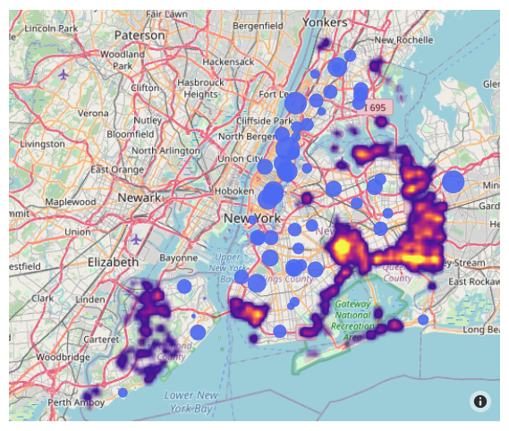

# Context
This repo contains a python Flask app that is published to [Heroku](https://pgs-ny-collisions.herokuapp.com/) looking at vehicle collisions and hospital provisions in New York, NY. The analysis closely follows the last geospatial analysis exercise on [Kaggle](https://www.kaggle.com/learn/geospatial-analysis), with the difference that the charts are plotted in plotly for easier integration in the front end of the app.

## Sample output:

All vehicle collisions further than 10km from the nearest hospital. Where should NY build more emergency rooms?

# ToDo
- I'd like to load the page before running the python command, otherwise the page load is very slow.
- It would be good to get some input from the website to go back to the python backend at some point (e.g. suggested new hospital locations)
